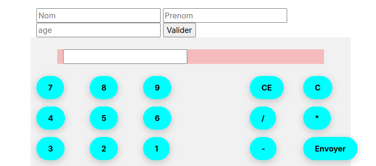

# Calculatrice Web en PHP

Ce projet est une simple calculatrice codée en PHP et HTML avec un peu de Bootstrap pour le style. L'interface permet d'entrer une opération mathématique et d'en afficher le résultat.

## Fonctionnalités

- Entrée des chiffres et opérateurs via des boutons.
- Évaluation de l'expression mathématique saisie.
- Affichage du résultat avec un système de troncature pour les résultats trop longs.
- Bouton CE pour effacer la saisie.
- Bouton C pour réinitialiser le champ de calcul.
- Interface responsive avec Bootstrap 5.

## Structure du projet

- `index.php` : Contient toute la logique PHP et l'interface utilisateur HTML.
- `calculator.css` : Fichier CSS optionnel pour styliser les boutons et l'affichage.
- Bootstrap 5 utilisé via CDN.

## Sécurité

⚠️ **Attention :** Le code utilise `eval()` en PHP, ce qui est **extrêmement dangereux** si les entrées ne sont pas parfaitement contrôlées. Ce projet ne doit **pas** être utilisé tel quel en production.

## Utilisation

1. Cloner ou télécharger le projet.
2. Placer les fichiers dans un serveur local compatible PHP (ex : XAMPP, WAMP...).
3. Accéder à `index.php` via votre navigateur.
4. Utiliser les boutons pour entrer une opération et appuyer sur "send" pour obtenir le résultat.

## Exemple

Entrée : `7 + 3 * 2`  
Sortie : `13`

## Améliorations possibles

- Remplacer `eval()` par un parseur d'expressions sécurisé.
- Ajouter la gestion des parenthèses.
- Ajouter un historique des calculs.
- Internationaliser l'interface.

## Auteur

Tom
